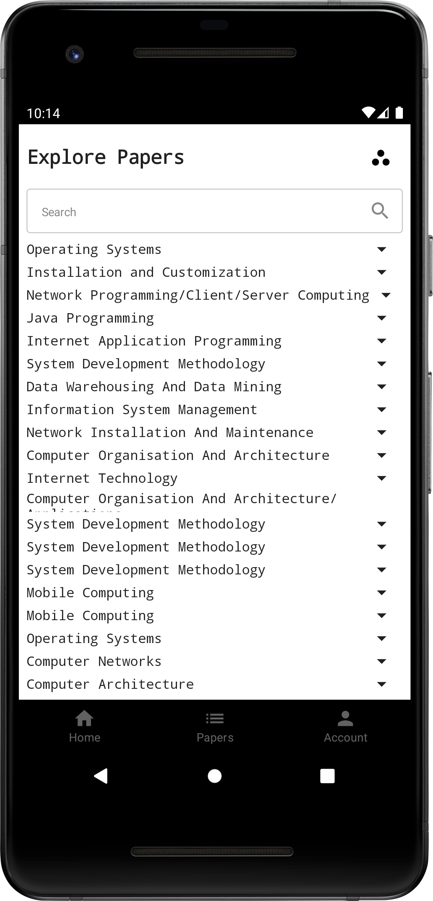

## Exam Bank Android
- A step-by-step development process for an Exam Bank Android Application, using [Kotlin](https://kotlinlang.org/)
- The app is to allow students have a user-friendly way to access previous year's examination materials

### Page Contents
* [Introduction](#introduction)
* [Application Specifications and Design Aspects](#requirements-specifications-and-dessign-aspects)
* [Coding Road map](#coding-roadmap)
* [External Resources](#external-resources)

### Introduction
> - The project is a Mobile-based application for students' access to past/revision papers.
> - Given the extensive span in previous papers, the web app goal is to allow stress-free online access.
> - In this illustration, the focus is on examination papers within only one school, e.g., Technology
> - After, other schools can be included and the Exam Bank for extended accessibility
#### Goals
> - To allow stress-free access to college past papers
> - Allow for easy navigation platform accessible at any time
> - Offer students and faculty a user-friendly and appealing user interface
> - Create an interactive platform with added features to support engagement
#### Tech Tools Used
> - Android Studio/Android Software Development Kit (**SDK**)
> - Jetpack Compose - Modern Android UI Toolkit
> - Kotlin - Made with **Kotlin** programming language
> - Android Virtual Device (**AVD**) Manager
> - Java Development Kit (**JDK**)
> - Firebase for data storage, registration, sign in and application validation
---
### Requirements Specifications and Design Aspects
User Interface (UX) features | Importance
-----------------------------|---------------------------
 1.Splash Screen             | Core
 2.Register                  | Core
 3.Sign In/Login             | Core
 4.Home Menu/Dashboard       | Core
 5.Per Academic Year Papers  | Core

### Core Layouts
- **Splash screen, Login Page, Register/Sign Up Page**
 

### External Resources
<!-- - You can check and download the application on Google Play [here](https://play.google.com/store/games?hl=en&gl=US) -->
